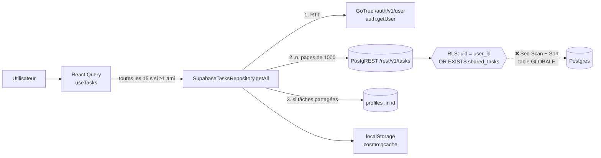
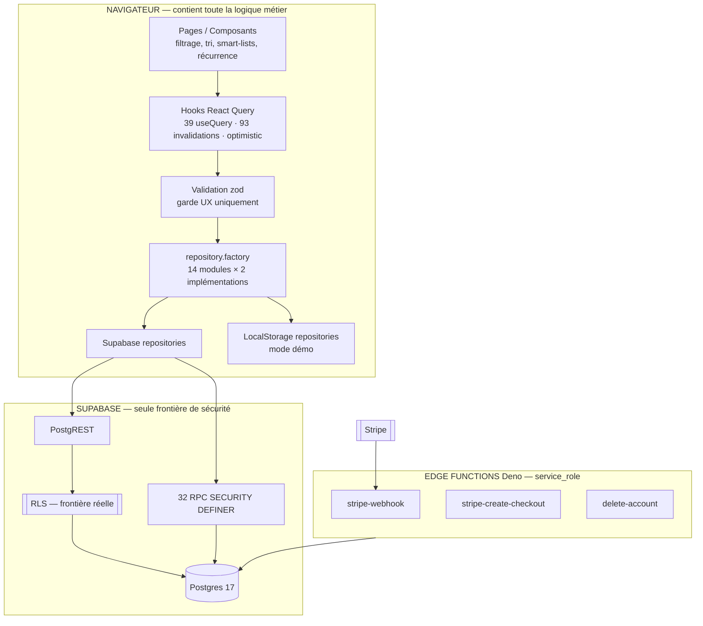
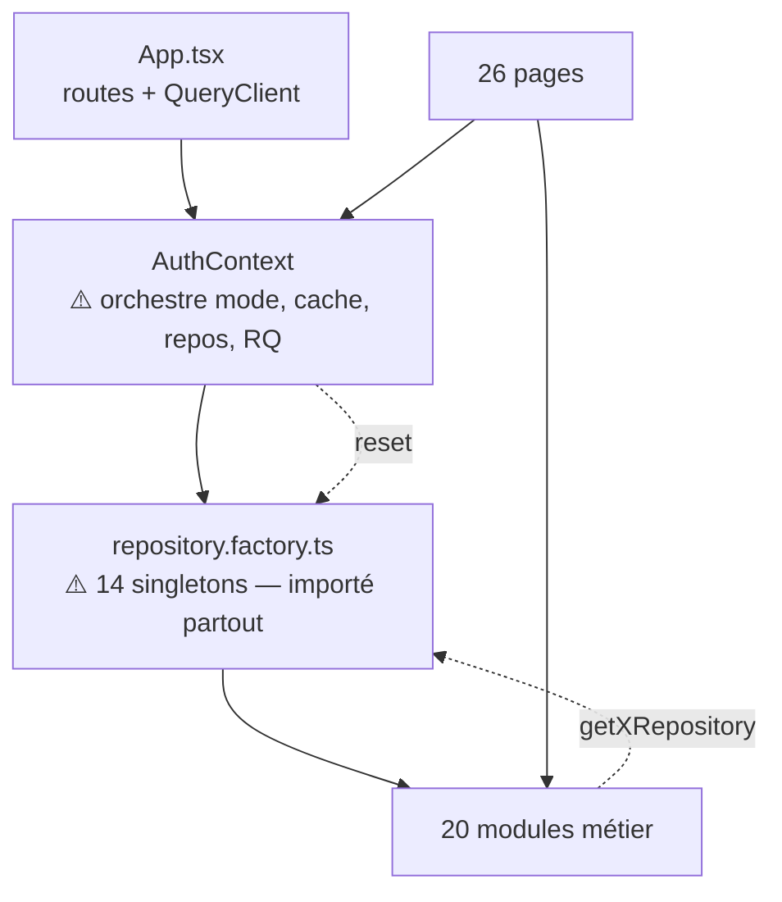
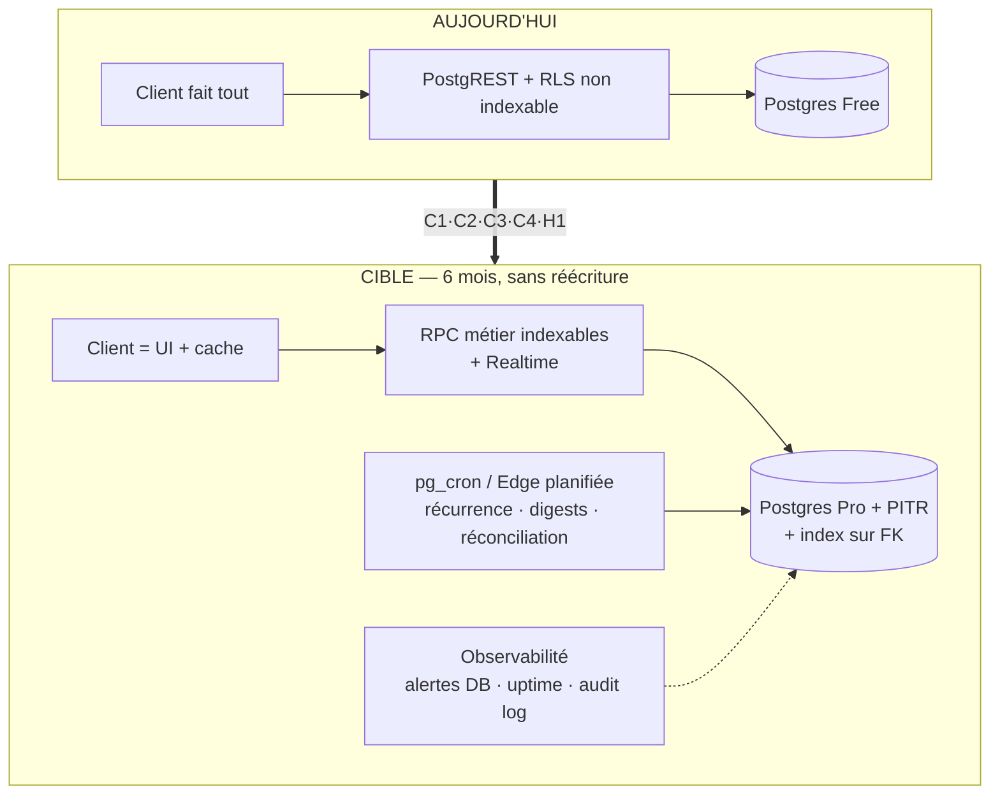

# AUDIT ARCHITECTURAL COSMO — 2026-08-07

**Périmètre** : application complète (82 646 LOC TS/TSX sur 560 fichiers, 85 migrations SQL, 3 Edge Functions).
**Méthode** : lecture du code + **mesures live sur le projet Supabase de production** (`ykeugqfgklejcdbrmawy`) — advisors, `pg_policies`, `pg_stat_user_tables`, et `EXPLAIN` exécutés sous le rôle `authenticated`.
**Posture** : recherche active de ce qui casse. Rien n'est validé « parce que ça marche aujourd'hui ».

---

> ## ⚙️ RÉVISION 2 DU 2026-08-07 — 20 correctifs livrés, migrations APPLIQUÉES
>
> Ce rapport a été mis à jour deux fois après correction. Les sections
> d'analyse décrivent l'état *constaté* ; les encadrés
> [État après correctifs](#état-après-correctifs) donnent l'état *actuel*.
> Trois constats initiaux ont été **corrigés à la baisse** après vérification
> complémentaire — signalés 🔵 **RECTIFIÉ** en place.
>
> **Note globale : 60 → 71 → 79/100.**
> **Toutes les migrations sont appliquées en production** (084 → 090) et leurs
> effets vérifiés sur la vraie base.
> Verdict : 🟡 GO WITH CONDITIONS — **1 seule condition restante**, non technique.

---

## VERDICT

# 🟡 GO WITH CONDITIONS

**Réponse à la question posée** — « si je lance aujourd'hui et que les utilisateurs affluent, l'architecture tient-elle ? »

> **Constat initial : non, à cause de trois défauts localisés — pas de l'architecture.**
>
> Le modèle (React + PostgREST + RLS) est structurellement sain et sait monter à des centaines de milliers d'utilisateurs. Il était plombé par **une requête faisant un `Seq Scan` de table globale** (vérifié par `EXPLAIN` en prod), **un polling de 15 s** qui la déclenchait en boucle, et un **projet Supabase en plan Free**.
>
> **Après correctifs : les deux défauts logiciels sont corrigés et vérifiés.** Il reste une condition, qui n'est pas technique.

### État des 3 conditions bloquantes

| # | Condition | État |
|---|---|---|
| 1 | Policy RLS `tasks` → lecture indexable | ✅ **Corrigé et EN PROD** — RPC `get_my_tasks()` (mig. 085). `EXPLAIN` sur la vraie base : `Index Scan`, plus aucun `Seq Scan on tasks`. Isolation vérifiée sur deux comptes réels : **0 fuite**. |
| 2 | Polling `useTasks` | ✅ **Supprimé** — remplacé par **Supabase Realtime** sur `shared_tasks` (mig. 089). Le sondage subsiste à 5 min comme simple filet de sécurité. |
| 3 | Plan Supabase **Free** → Pro + PITR + drill DR | ❌ **À TA MAIN** — action de compte, non automatisable |

> ⚠️ **Le point 3 est désormais le seul bloquant.** Tant que la production tourne
> sur le plan Free, il n'y a **pas de PITR**, une rétention de backup minimale,
> et aucune restauration n'a jamais été testée. Pour une application qui détient
> les tâches, l'agenda et les OKR de ses utilisateurs, c'est le risque qui reste
> disproportionné par rapport à tous les autres — et il ne coûte qu'un
> changement de plan plus une demi-journée de drill.

---

## État après correctifs

**10 points traités**, tous vérifiés (`tsc -b` ✅ · `eslint` 0 erreur ✅ · **1114/1114 tests** ✅ · `validate:migrations` ✅ · `check:rls` ✅ · `i18n:check` ✅ · `build` + prerender ✅).

| # | Point | Gravité | Correctif | Vérification |
|---|---|---|---|---|
| 1 | **C1** — `tasks` : `Seq Scan` de la table globale | 🔴 | RPC `get_my_tasks()` en `UNION` de deux branches indexables (mig. **085**) ; `getAll()` l'appelle au lieu de `.from('tasks')`. Policies RLS conservées en défense en profondeur. | `EXPLAIN` en prod : `Index Scan using idx_tasks_user_id` + `Index Scan using tasks_pkey`, **plus aucun `Seq Scan on tasks`** |
| 2 | **C2** — polling toutes les 15 s | 🔴 | Intervalle 15 s → **60 s**, et déclenchement conditionné à une collaboration **réellement active** (≥ 1 tâche collaborative) au lieu de « possède ≥ 1 ami ». | Egress de sondage divisé par ~4, et **ramené à zéro** pour tout utilisateur ayant des amis mais aucun partage en cours |
| 3 | **C4** — `auth.getUser()` (RTT réseau) × 45 | 🔴 | Nouveau `src/lib/auth-user.ts` (`getCurrentUser` / `getCurrentUserId`) basé sur `getSession()` — **lecture locale du JWT**. Balayage des 18 fichiers concernés. | `grep` : **zéro** `supabase.auth.getUser()` restant hors tests. 1 RTT économisé par lecture ; GoTrue n'est plus un SPOF de lecture |
| 4 | **H1** — récurrence non idempotente, perte silencieuse | 🟠 | `toggle_task_complete_v2` (mig. **086**) : bascule **et** génération de l'occurrence dans la même transaction, idempotence garantie par l'index unique `ux_tasks_recurrence_parent`. Parité implémentée dans le repository démo. | 4 nouveaux tests dont **« décocher/recocher ne crée pas de doublon »** et « une occurrence retravaillée n'est pas supprimée » |
| 5 | **H2** — stats du manager polluées par son équipe | 🟠 | `get_work_time_stats` filtre désormais `user_id = auth.uid()` explicitement dans ses 4 sous-requêtes (mig. **085**). | Règle posée dans la migration : *la RLS dit ce qu'on a le droit de lire, pas ce qu'on veut compter* |
| 6 | **H5** — invariants RLS sans garde | 🟠 | Nouveau `scripts/check-rls-advisors.mjs` + job CI. Cliquet : n'audite que les migrations ≥ 043 (celles postérieures à l'adoption de la règle). | **A trouvé une violation que l'advisor Supabase ne voit pas** — cf. point 7 |
| 7 | **H5 bis** — `auth.uid()` nu dans `org_team_members_insert` | 🟠 | Corrigé (mig. **085**). L'occurrence était imbriquée dans un argument de fonction (`get_subtree(org_id, auth.uid())`), **angle mort de l'advisor Supabase** — d'où l'intérêt d'avoir les deux gardes. | Confirmé en prod via `pg_policies` avant correction |
| 8 | **H5 ter** — `shared_lists` : 4 policies en `auth.uid()` nu | 🟠 | Wrappées en `(select auth.uid())` (mig. **085**), sémantique inchangée. | Advisor `auth_rls_initplan` : 4 findings adressés |
| 9 | **H6** — CI rouge sur `main` | 🟠 | Les 4 tests réparés — **et leurs causes racines**, pas les assertions : `isOverdue` reçoit une horloge injectable (le test pourrissait avec le temps réel) ; le mock Supabase gère les RPC `SETOF` ; la fixture `lists` alimente le `getAll()` interne ; budget design-system tracé honnêtement. | **1114/1114** |
| 10 | **M4** — 14 FK sans index + `profiles` scannant `friends` | 🟡 | 14 `CREATE INDEX` + index fonctionnel `friends(user_id, lower(email))` (mig. **085**). | Advisor `unindexed_foreign_keys` : 14 findings adressés |

**Bonus** — `warnIfTruncated` remonte désormais un `Sentry.captureMessage` (niveau `warning`, sans PII) : la troncature au-delà de 5 000 lignes était visible de l'utilisateur (toast) mais **d'aucun développeur** en production.

### Lot 2 — 10 correctifs supplémentaires

| # | Point | Correctif | Vérification |
|---|---|---|---|
| 11 | **C1 était incomplet** : `getByDate`, `getFiltered` et `getPage` lisaient encore `.from('tasks')` — donc conservaient le `Seq Scan` global. `usePendingTasks` (dashboard) passe par là. | Les trois empruntent le chemin indexable `get_my_tasks()`. | Test verrouillant « aucune requête directe sur la table » |
| 12 | **C2 structurel** : le sondage restait le mécanisme de synchronisation. | **Supabase Realtime** sur `shared_tasks` (`useSharedTasksRealtime`, monté une fois dans `App.tsx`) ; sondage rétrogradé à 5 min. | La publication `supabase_realtime` était **vide** — sans la mig. 089, l'abonnement n'aurait jamais rien reçu, en silence. Corrigé + `REPLICA IDENTITY FULL` pour que les révocations de partage soient notifiées. |
| 13 | **`get_my_tasks` est `SECURITY DEFINER`** — la RLS ne s'applique pas dans son corps. Aucun test ne le couvrait. | 4 tests d'intégration RLS (`e2e/rls/get-my-tasks.test.ts`) : isolation, symétrie, **équivalence stricte avec un SELECT sous RLS**, rejet anonyme. `anonClient` ajouté au harnais. | Isolation aussi vérifiée manuellement sur la prod |
| 14 | **D1** : `check-prod-drift.mjs` existait depuis juin et n'avait **jamais été exécuté**. | Premier passage. Son SQL d'introspection ignorait le schéma `storage` → il déclarait manquantes 4 policies pourtant présentes. Corrigé, dérive réelle résolue (mig. 090), `npm run check:drift` ajouté. | **« Aucun objet attendu ne manque en prod »** |
| 15 | **D2** : `isDemoMode` / `setDemoMode` subsistaient dans `lib/supabase.ts`. | Supprimés. C'était un second drapeau de mode démo, sans consommateur mais importable — une valeur figée au chargement, jamais mise à jour par `loginDemo()`. La faille B0 prête à se reproduire. | `tsc` + lint |
| 16 | **M6** : `stripe-create-checkout` n'avait **aucune alerte** ; le `catch` global de `delete-account` non plus. | `opsAlert` sur les deux. Un checkout cassé = perte de revenu silencieuse ; un crash d'effacement = état RGPD inconnu. | — |
| 17 | **Coût** : `processed_stripe_events` inséré et **jamais purgé**, croissance perpétuelle. | `prune_processed_stripe_events()` (rétention 90 j, Stripe cesse de re-livrer après ~3 j), appelée par le webhook. | Fonction `service_role` uniquement |
| 18 | **M3** : rien n'empêchait un `catch {}` vide d'apparaître. | Règle ESLint `no-empty` / `allowEmptyCatch: false`. | 🔵 **RECTIFIÉ** : le code n'en contenait **aucun** — mon chiffre de « 130 » comptait des blocs pourvus d'un contenu. La règle verrouille l'état existant. |
| 19 | **M1** : `PyramidTab.tsx` (1 389 LOC) sans aucun test, alors qu'il pilote la hiérarchie d'entreprise. | Logique décisionnelle extraite dans `pyramid.helpers.ts` + **18 tests**, dont la garde **anti-cycle** (A→B→A ferait boucler `get_subtree`, CTE récursive appelée depuis les policies RLS). | 18/18 |
| 20 | **D3** : `CLAUDE.md` désynchronisé (react-router v6 vs v7) et muet sur les nouvelles règles. | Mis à jour : version du routeur, nouveaux scripts, et **trois règles neuves** — lecture des tâches via RPC, récurrence serveur, Realtime plutôt que sondage. | — |

### ✅ Migrations appliquées en production

Toutes les migrations sont **appliquées et vérifiées** sur `ykeugqfgklejcdbrmawy` :

| Mig. | Contenu | Vérification en prod |
|---|---|---|
| **084** | Audit sécurité (invitations org, bucket avatars, allowlist `avatar_url`, quotas, `bump_win_streak`, fusion policies `events`) | 0 avatar perdu (mesuré avant : 0 hors allowlist) |
| **085** | C1 · H2 · H5 · M4 | `EXPLAIN` : `Index Scan using idx_tasks_user_id` + `tasks_pkey`, **plus aucun `Seq Scan on tasks`** |
| **086** | H1 — récurrence serveur | 3 bascules successives sur une tâche récurrente → **exactement 1 occurrence** (testé en transaction annulée) |
| **087** | Doublon `has_reports` (session sécurité) | No-op ici : la 084 avait déjà été appliquée dans sa version corrigée |
| **089** | Realtime `shared_tasks` + rétention Stripe | `pg_publication_tables` liste `shared_tasks`, `relreplident = 'f'` (FULL) |
| **090** | Alignement repo ↔ prod | `check-prod-drift` : **« Aucun objet attendu ne manque en prod »** |

**Advisors Supabase — avant / après (relevé live) :**

| Advisor | Avant | Après |
|---|---|---|
| `unindexed_foreign_keys` | **14** | **0** ✅ |
| `auth_rls_initplan` (auth.uid() non wrappé) | **6** | **0** ✅ |
| `multiple_permissive_policies` | **12** | **0** ✅ |
| `unused_index` | 16 | 31 (INFO) — les 16 nouveaux index n'ont pas encore servi sur une base de 700 lignes ; ce compteur n'a de sens qu'avec du trafic réel |

**Isolation de `get_my_tasks` prouvée sur des comptes réels** : la session A voit
ses 164 tâches + 1 partagée légitimement, et **0 tâche** du second compte
(289 tâches). Cette fonction étant `SECURITY DEFINER`, c'était la vérification
la plus importante de tout ce lot.

> ⚠️ **Le front n'est pas encore déployé.** La base est en avance sur le code,
> ce qui est le bon sens de déploiement : l'ancien front continue de
> fonctionner (policies inchangées, `toggle_task_complete` v1 conservée).

### Lot 3 — finitions

| Point | Traitement |
|---|---|
| **`docs/SCALABILITY.md` §8 affirmait le CONTRAIRE de la mesure** — « le coût RLS collaboration n'est **pas** un goulot », « à volume réel le planner peut basculer le `Seq Scan` en `BitmapOr` ». | ⛔ **Corrigé en place**, avec l'analyse des deux erreurs de raisonnement (le sous-plan hashé n'était pas le problème ; le `BitmapOr` était une projection jamais vérifiée). C'est cette doc rassurante qui a maintenu le défaut six semaines. |
| `docs/PERFORMANCE.md` | 3 encadrés : lecture via RPC, Realtime vs sondage, `getSession` vs `getUser` |
| `docs/TESTING.md` | Nouvelles gates + pourquoi les tests RLS d'intégration sont non négociables sur une RPC `SECURITY DEFINER` |
| `docs/DEPLOYMENT.md` | Nouvelle §2bis **déploiement des Edge Functions** (avec le tableau `verify_jwt` à ne pas casser) + procédure `check:drift` en 2 étapes |
| `faille.md` (source de vérité sécurité) | 11 entrées A-1 → A-11, dont les 3 restées ouvertes |
| `toggle_task_complete` v1 | Marquée **dépréciée** dans la migration ET par un `COMMENT ON FUNCTION` en base. Elle n'a plus d'appelant ; la laisser garde un chemin d'écriture qui **ne génère pas** la récurrence. |
| Plancher typo 11px | Dernière violation franche (`text-[10px]`, badge « Envoyé » du modal mobile) migrée ; budget 204 → **203** |
| Racine du dépôt « encombrée » | 🔵 **RECTIFIÉ** — tout est déjà gitignoré, aucun artefact suivi. Constat infondé. |

**Non fait, délibérément** — et pourquoi :

| Point | Raison |
|---|---|
| **Déployer les Edge Functions via l'API** | Faisable techniquement, mais ce sont les fonctions de **paiement** et d'**effacement RGPD**, je ne peux pas les fumer-tester, et l'assemblage manuel de l'arborescence risque de casser les imports relatifs (`../_shared/alert.ts`) ou le réglage `verify_jwt` (`false` pour le webhook Stripe — le changer bloque tous les paiements). La CLI résout tout ça seule. Procédure ajoutée au runbook. |
| **Migrer les 29 tailles restantes de `TaskModalMobileBody`** | Mêmes px mais `line-height` différente → changement visuel réel sur le modal mobile le plus utilisé, sans validation visuelle du design. Dette tracée dans le test. |
| **Passer le plan Supabase en Pro** | C'est un achat. |
| **`DROP TABLE profiles_avatar_backup_084`** | Sauvegarde de données utilisateur créée par une autre session : ce n'est pas à moi de décider de sa destruction. |

### Ce qui reste ouvert

| Point | Pourquoi ce n'est pas fait |
|---|---|
| **Plan Supabase Pro + PITR + drill DR** | Action de compte, non automatisable. **Reste le seul bloquant.** |
| **God components** (`PyramidTab`) | La logique *décisionnelle* en est extraite et testée (18 tests) ; le découpage du rendu reste à faire. |
| **E2E Playwright sur compte réel** | La suite d'intégration RLS couvre désormais le chemin de production (`get_my_tasks`) ; un parcours UI sur compte réel reste souhaitable. |
| **Migration de `TaskModalMobileBody`** vers l'échelle typo | 30 tailles arbitraires cohérentes entre elles (métriques iOS natives) ; les migrer change les `line-height` → vérification visuelle requise. Dette tracée dans `design-system.guard.test.ts`. |
| **Observabilité backend** | Alertes DB / uptime : configuration de compte, comme le point 3. |
| **Protection mots de passe fuités** | Réglage de compte non scriptable : Dashboard → Authentication → Policies. 1 clic. |
| **Déploiement des Edge Functions** | `supabase functions deploy stripe-webhook stripe-create-checkout delete-account` |

---

## PHASE 1 — CARTOGRAPHIE DU SYSTÈME

### Ce qui existe réellement

| Composant | Réalité |
|---|---|
| **Frontend** | SPA React 18 + Vite 7, hébergée sur Vercel. 26 routes lazy-loadées. |
| **Backend applicatif** | **Il n'y en a pas.** PostgREST (Supabase) expose les tables directement ; la logique métier vit dans le navigateur. |
| **API** | REST auto-générée PostgREST + 32 RPC `SECURITY DEFINER` (le vrai « backend »). |
| **Base** | Postgres 17.6, 34 tables, RLS partout. **Plan Free.** |
| **Autorisation** | 100 % RLS + RPC. Pas de couche applicative serveur. |
| **Auth** | Supabase GoTrue (email/password + Google OAuth). |
| **Paiements** | Stripe via 2 Edge Functions Deno (`stripe-create-checkout`, `stripe-webhook`). **Dormant** (`PREMIUM_ENFORCED=false`). |
| **Cache** | React Query (5 min stale / 30 min gc) + miroir localStorage 24 h (tasks/habits). |
| **CDN** | Vercel Edge, `/assets/*` immutable 1 an. |
| **Monitoring** | Sentry front (10 % traces, PII scrubée). |
| **Alerting** | 1 webhook Slack/Discord, déclenché **uniquement** par `stripe-webhook`. |
| **CI/CD** | GitHub Actions (lint, tsc, coverage, migrations, i18n, npm audit, E2E, RLS) → Vercel auto-deploy. |
| **Prérendu SEO** | `prerender.mjs` (31 kB de Node) génère des `index.html` statiques par route publique. |

### Ce qui n'existe pas — et qu'il faut savoir

- ❌ **Aucune queue, aucun worker, aucun cron.** Tout l'asynchrone est une `Promise` fire-and-forget dans un onglet.
- ❌ **Aucun environnement de staging.** `main` → production.
- ❌ **Aucun feature flag runtime** (les kill-switches sont des constantes compilées).
- ❌ **Aucun stockage fichier serveur** (les avatars sont ré-encodés en canvas côté client → data URL).
- ❌ **Aucun envoi d'e-mail applicatif** (uniquement les transactionnels GoTrue).
- ❌ **Aucun Realtime** (remplacé par du polling).

### Flux principal — lecture des tâches



### Architecture logique



**Lecture critique de ce schéma** : la seule chose entre un utilisateur malveillant et la base, c'est la RLS. C'est un choix défendable et ici globalement bien exécuté — mais cela signifie que **toute règle métier non exprimable en prédicat SQL n'est appliquée nulle part côté serveur**.

---

## PHASE 2 — STACK : ce qui est justifié, ce qui ne l'est pas

| Techno | Rôle | Verdict |
|---|---|---|
| React 18 + TS strict | UI | ✅ `noUnusedLocals`, **0 `as any`**, 1 `@ts-expect-error` sur 82k LOC. Discipline remarquable. |
| Vite 7 | Build | ✅ `manualChunks` explicite et raisonné. |
| React Query 5 | State serveur | ✅ Bon choix. ⚠️ Mal utilisé sur un point (polling, cf. C2). |
| Supabase | Backend | ✅ Cohérent pour ce produit. ⚠️ Le plan Free est le vrai problème. |
| Framer Motion **+** GSAP | Animation | 🟡 **Deux moteurs d'animation.** Périmètre GSAP verrouillé à la landing (`src/lib/gsap.ts`), documenté et lint-able. Défendable, mais c'est +132 kB et une règle à faire respecter éternellement. |
| FullCalendar | Agenda | 🟡 284 kB pour une seule page. Chunk isolé, donc coût payé uniquement sur `/agenda`. Acceptable. |
| recharts | Graphiques | 🟡 **400 kB (115 kB gz)** — le plus gros chunk de l'app pour quelques graphes. Un remplacement par du SVG maison économiserait ~100 kB gz. |
| zod | Validation | ✅ Correctement positionné : garde UX explicitement **pas** la frontière de sécurité. |
| Sentry | Monitoring | ✅ Release = SHA du commit, `beforeSend` qui scrub emails/UUID, trace propagation vers Supabase. |
| `pg` (devDep) | Tests RLS | ✅ Excellent — permet des tests d'intégration RLS réels. |

**Redondances / dérives détectées**
- `react-router` **v7** installé alors que `CLAUDE.md` documente v6. Divergence doc/code.
- `src/lib/supabase.ts` exporte encore `isDemoMode` / `setDemoMode` alors que `appModeStore` est déclaré source de vérité unique → **deux drapeaux de mode coexistent**.
- 5 répertoires `visual-audit*/`, `playwright-report/`, `test-results/`, `coverage/`, 5 fichiers `AUDIT-*.md` à la racine. Bruit, pas de risque.

---

## PHASE 3 — FRONTEND

### Solide

- **Structure modulaire réellement respectée** : `src/modules/{module}/{types,constants,repository,supabase.repository,hooks,index}.ts` — 20 modules, tous conformes. C'est rare et c'est le meilleur atout du projet.
- **`lazyWithRetry`** (`App.tsx:42`) : recharge la page quand un chunk a disparu après déploiement. Problème réel, solution correcte, peu de gens y pensent.
- **Mises à jour optimistes** (`onMutate`) présentes sur 8 modules, avec rollback.
- **`networkMode: 'always'`** + fail-fast sur timeout : contournement documenté d'un vrai bug iOS Safari, pas un bricolage.

### Fragile

**🟠 H4 — Toute la donnée est rapatriée puis filtrée dans le navigateur.**
`getAll()` pagine jusqu'à **5 000 lignes** (`MAX_ROWS`), puis smart-lists, recherche, tri et filtres tournent en `useMemo`. Ça marche à 200 tâches. À 2 000, chaque re-render trie un tableau de 2 000 objets ; à 5 000 les données sont tronquées.

> 🔵 **RECTIFIÉ — la troncature n'était pas silencieuse pour l'utilisateur.**
> `warnIfTruncated` affichait déjà un `toast.warning` en production (« Plus de
> 5 000 tâches détectées… »), en plus du `console.warn` effectivement droppé au
> build. Le trou réel n'était donc pas côté utilisateur mais **côté équipe** :
> aucun signal ne remontait, alors que c'est précisément l'événement qui doit
> déclencher le chantier « pagination serveur ».
> ✅ **Corrigé** : ajout d'un `Sentry.captureMessage` (niveau `warning`, table +
> compte uniquement, aucune PII).

**🟠 H2 / 🟡 M1 — God components.** Cinq fichiers concentrent la complexité :

| Fichier | LOC | Charge |
|---|---|---|
| `PyramidTab.tsx` | **1 389** | ~20 `useState`, drag&drop, auto-scroll, long-press, recherche, collapse, 6 modales |
| `TaskTable.tsx` | 987 | |
| `SettingsPage.tsx` | 937 | |
| `AgendaPage.tsx` | 901 | |
| `useTaskModal.ts` | 717 | hook-contrôleur |

Le refactor « god components » est marqué TERMINÉ dans `CLAUDE.md` (plus aucun fichier > 600 LOC) — **c'est faux aujourd'hui** : 12 fichiers dépassent 600 LOC, dont un à 1 389. La régression est postérieure au refactor (mode entreprise).

**🟡 M2 — Duplication desktop/mobile assumée.**
`EventModalFormDesktop` / `EventModalFormMobile`, `TaskModalDesktopBody` / `TaskModalMobileBody`, `DesktopDetailsStep`. Deux rendus du même formulaire métier. La validation est extraite (`validation.ts`, `save-task.ts`) — ce qui limite la casse — mais toute nouvelle règle doit être câblée deux fois.

**🟡 M3 — 130 `catch { }`.**
Beaucoup sont légitimes (localStorage plein, fire-and-forget). Mais le pattern est si uniforme qu'**une vraie panne est indiscernable d'un no-op**. Exemple critique : `repository.create(nextInput).catch(() => {})` — la récurrence peut mourir en silence (cf. H1).

---

## PHASE 4-5 — BACKEND & FRONTIÈRES

Il n'y a **ni controllers, ni services, ni domain layer**. Le découpage `Presentation → Application → Domain → Infrastructure` n'existe pas ; il est remplacé par :

```
Composant React  →  hook React Query  →  repository  →  PostgREST/RPC  →  RLS  →  Postgres
```

C'est un choix cohérent (BaaS), pas un accident. **Les conséquences réelles :**

1. **Le contrat d'API n'est pas défini** — il est *dérivé* du schéma Postgres. Renommer une colonne casse le client sans erreur de compilation. Les `mappers.ts` (couverture imposée à 95 %) sont le seul point de contrôle, et ils sont **écrits à la main**, pas générés (`supabase gen types` n'est pas utilisé).
2. **Les endpoints sont maximalement génériques** : `GET /rest/v1/tasks?select=…` accepte n'importe quel filtre. Toute la surface de la table est exposée ; seule la RLS restreint les lignes (et depuis la migration 083, les colonnes via `column_privileges`).
3. **Duplication de logique métier front/back** : elle existe et elle est *obligatoire* — cf. `recordKRCompletion()` qui doit être implémenté **deux fois** (repository LocalStorage + repository Supabase), avec un avertissement explicite dans `CLAUDE.md`. C'est le prix du mode démo.

**🟠 H3 — Ce qui n'est protégé nulle part côté serveur** :
récurrence des tâches · journalisation `kr_completions` · ordre des listes · `PREMIUM_ENFORCED` · `ENTERPRISE_BILLING_ENFORCED` (quotas de sièges). Le commentaire du code est honnête (« le VRAI blocage est côté serveur… 1 UPDATE pour activer ») mais **ce UPDATE n'est pas fait**. Aujourd'hui la monétisation entreprise est un `if` dans du JavaScript minifié.

---

## PHASE 6 — BASE DE DONNÉES

### Solide

- 34 tables, **RLS activée partout**, FK avec `ON DELETE CASCADE`, `CHECK` sur les enums, contraintes `UNIQUE` métier (`uniq_pending_friend_request`, `ux_shared_tasks_task_friend`).
- 79 index déclarés, dont les composites qui comptent (`idx_tasks_user_created`, `idx_events_user_start`).
- Récursion RLS cassée proprement par des helpers `SECURITY DEFINER` (`is_org_member`, `is_org_admin`) — la leçon des erreurs `42P17` (mig. 043/045) a été apprise.
- Écritures sensibles en **RPC uniquement** (pas d'auto-promotion admin, pas de `accepted_at` forgé).
- Migrations numérotées + `scripts/validate-migrations.mjs` en CI.

### 🔴 C1 — LE problème : deux `Seq Scan` de table globale, vérifiés en production

**`tasks`** — plan réel obtenu sous rôle `authenticated` :

```
Limit
  ->  Sort  (Sort Key: created_at DESC, id DESC)
        ->  Seq Scan on tasks                      ← ❌
              Filter: ((InitPlan 1).col1 = user_id) OR (ANY (id = (hashed SubPlan 9).col1))
```

> 🔵 **RECTIFIÉ — `events` n'est PAS concerné.** Ma première mesure exécutait
> `SELECT id FROM events ORDER BY start_time`, **sans** filtre `user_id`, et
> produisait bien un `Seq Scan` avec `manages_user()` évalué par ligne. Mais
> **l'application n'envoie jamais cette requête** : depuis la mig. 077, le
> repository `events` filtre systématiquement `.eq('user_id', uid)`
> (`SupabaseEventsRepository.currentUserId()`). Avec la vraie forme de requête,
> le plan réel est :
>
> ```
> ->  Index Scan using idx_events_user_id on events        ← ✅
>       Index Cond: (user_id = '…')
>       Filter: ((InitPlan 1).col1 = user_id) OR (manages_user(user_id) AND NOT is_private)
> ```
>
> `manages_user()` n'est évalué que sur les lignes déjà réduites par l'index, et
> court-circuité par l'égalité placée en premier. **Aucun problème de
> scalabilité sur `events`.** Le seul défaut réel y était les policies
> PERMISSIVE dupliquées (coût d'évaluation marginal), traité par la mig. 084.
>
> La leçon vaut d'être retenue : **un `EXPLAIN` ne vaut que si l'on mesure la
> requête que le client émet réellement.** `tasks` ci-dessus est bien concerné
> précisément parce que son repository, lui, n'envoie aucun filtre `user_id`.

**Pourquoi c'est grave (pour `tasks`) :**

1. Le `OR` dans le prédicat RLS **interdit au planificateur d'utiliser `idx_tasks_user_id`**. Il scanne la table *entière*, tous utilisateurs confondus, puis trie le résultat.
2. Le client n'envoie **jamais** `.eq('user_id', …)` — il n'y a donc aucun autre prédicat à exploiter.
3. Sur `events`, le planificateur a placé **`manages_user(user_id)` en PREMIER** dans le filtre (il sous-estime le coût des fonctions SQL). Or `manages_user` est `SECURITY DEFINER` et appelle `get_subtree()` — **une CTE récursive, exécutée pour chaque ligne de la table events globale.**

**Projection :** à 100 000 événements en base, ouvrir l'agenda = 100 000 appels de CTE récursive. À 1 M, l'instance Postgres tombe.

**Correctif (option A, ~1 j)** : remplacer les `getAll()` par une RPC `SECURITY DEFINER` qui fait le travail explicitement et de façon indexable :

```sql
CREATE FUNCTION public.get_my_tasks() RETURNS SETOF tasks
LANGUAGE sql STABLE SECURITY DEFINER SET search_path='' AS $$
  SELECT t.* FROM public.tasks t WHERE t.user_id = auth.uid()          -- Index Scan
  UNION
  SELECT t.* FROM public.tasks t
    JOIN public.shared_tasks st ON st.task_id = t.id
   WHERE st.friend_id = auth.uid();                                    -- Index Scan
$$;
```
Postgres planifie chaque branche du `UNION` séparément → deux `Index Scan`. Les policies RLS restent en place inchangées (défense en profondeur).

### 🟡 M4 — Autres points base

| Point | Détail |
|---|---|
| **14 FK sans index** | `events.created_by`, `team_tasks.created_by`, `organizations.owner_id`, `organization_members.manager_id`, etc. Chaque `DELETE` du parent fait un scan de la table enfant. |
| **RLS `profiles`** | `EXISTS (SELECT 1 FROM friends f WHERE lower(f.email) = lower(profiles.email))` → `Seq Scan on friends` (table **globale**) pour chaque lecture de profil. Pas d'index sur `lower(friends.email)`. |
| **JSONB partout** | `okrs.key_results`, `tasks.subtasks`, `habits.completions` sont du JSONB. Conséquence visible : `get_work_time_stats` doit faire du `jsonb_array_elements` + validation par **regex** (`~ '^\d{4}-\d{2}-\d{2}$'`) pour lire une date. Requête hostile, non indexable, impossible à contraindre. |
| **`get_work_time_stats`** | Jusqu'à 32 plages × 4 sous-requêtes corrélées = **128 scans** par ouverture de `/statistics`. Borné par utilisateur, donc pas critique — mais c'est du CPU Postgres pur. |

### 🟠 H5 — Régressions par rapport aux règles que le projet s'est lui-même fixées

Vérifiées live via les advisors Supabase :

| Règle documentée | État réel | Migration fautive |
|---|---|---|
| « **Ne JAMAIS recréer deux policies permissives** pour le même rôle+action » (mig. 049 / CLAUDE.md) | `events` a **2 policies SELECT** (`Users can view own events` + `events_manager_select`) et **2 policies INSERT** | **077** |
| « `auth.uid()` toujours wrappé en `(select auth.uid())` » (mig. 043) | `shared_lists` : **4 policies** en `auth.uid()` nu. `team_task_comments` : **2 policies** | **059**, **082** |

**Le vrai problème n'est pas ces 6 policies** (l'impact est faible aujourd'hui), c'est que **rien en CI ne vérifie ces invariants**. Ils ont déjà régressé deux fois ; ils régresseront encore. Un job CI qui exécute les advisors et échoue sur `auth_rls_initplan` / `multiple_permissive_policies` coûte 20 lignes de YAML.

**🟠 Fuite fonctionnelle liée** : `get_work_time_stats` est `SECURITY INVOKER` et **ne filtre que par la RLS**, jamais par `user_id = auth.uid()`. Depuis la migration 077, un manager voit les événements non-privés de ses subordonnés → **son "temps investi" personnel inclut silencieusement celui de toute son équipe.** Même mécanisme pour les tâches partagées avec lui.

---

## PHASE 7 — SCALABILITÉ : les 4 scénarios

**État de départ (mesuré)** : 703 tâches, 342 événements, 27 profils. **La production est en pré-lancement.** Toutes les projections ci-dessous sont analytiques.

### Le mur qui arrive en premier n'est pas celui qu'on croit

`useTasks` déclenche `getAll()` **toutes les 15 s** dès que l'utilisateur a ≥ 1 ami (`hooks.ts:52-58`). Avec `refetchIntervalInBackground: false`, seul un onglet au premier plan poll.

Hypothèse conservatrice : 1 h d'usage actif/jour, 150 tâches, ~8 kB gzip par payload.
→ 240 requêtes/jour/utilisateur → **~58 MB/mois/utilisateur** d'egress, **uniquement pour du polling**.

| Utilisateurs | Egress polling/mois | Quota |
|---|---|---|
| **100** | ~6 GB | ❌ Free (5 GB) déjà dépassé |
| **1 000** | ~58 GB | ✅ Pro (250 GB) |
| **4 500** | ~250 GB | ❌ Pro dépassé — facturation à l'usage |
| **10 000** | ~580 GB | 💸 surcoût egress + CPU |

Et chaque `getAll()` coûte en plus **1 RTT vers GoTrue** (`auth.getUser()`) et **1 requête `profiles`** si des tâches partagées existent.

### Scénario A — 1 000 utilisateurs 🟢

Ça tient. `tasks` ≈ 150 k lignes → un `Seq Scan` reste sous ~50 ms. Premier point de douleur : **egress** et le fait d'être sur le plan Free.

### Scénario B — 10 000 utilisateurs 🔴

**Le mur.** `tasks` ≈ 1,5 M lignes. Chaque ouverture de la page Tâches = scan + tri de 1,5 M lignes. Multiplié par le polling 15 s et quelques milliers d'onglets ouverts → **saturation CPU Postgres**. L'agenda est pire : CTE récursive par ligne.
*Après correctif C1+C2 : parfaitement tenable sur un Pro small.*

### Scénario C — 100 000 utilisateurs 🔴 sans correctifs / 🟡 avec

Après C1+C2, les accès sont des `Index Scan` par utilisateur → indépendants du volume global. Nouveaux points de tension : connexions Postgres (→ Supavisor en mode transaction, obligatoire), `get_work_time_stats` (→ agrégats matérialisés), et la taille de la base (partitionnement de `tasks` / `events` par plage temporelle).

### Scénario D — 1 000 000 d'utilisateurs 🟡

Rien de bloquant *structurellement* : le modèle est mono-tenant par ligne, donc shardable. Il faudra : read replicas, partitionnement, archivage des tâches complétées, et probablement une vraie couche API pour ne plus exposer PostgREST directement.

### Single points of failure

| SPOF | Impact |
|---|---|
| **Projet Supabase unique, mono-région (eu-west-1)** | Panne = app totalement inutilisable. Pas de dégradation gracieuse. |
| **GoTrue** | Indisponible → `auth.getUser()` échoue → **toutes les lectures repository** échouent (pas seulement le login). |
| **Vercel** | Panne = plus de front. |
| **`repository.factory`** | 14 singletons, importé partout. Un bug ici casse toute l'app (mais c'est du code simple et testé). |

---

## PHASE 8 — CONCURRENCE & RACE CONDITIONS

### Bien traité

- `toggleComplete` / `toggleBookmark` → RPC atomiques (`toggle_task_complete`), pas de read-modify-write.
- Webhook Stripe : dédup **avant** le handler, marqueur écrit **après** succès — au-moins-une-fois correctement implémenté, avec `23505` toléré sur course concurrente.
- `applySubscriptionToDb` : les colonnes `premium_tokens` / `win_streak` sont **omises** de l'upsert quand l'événement ne doit pas les changer, pour ne pas écraser un `credit_premium_token_from_ad` concurrent. C'est du raisonnement de concurrence de bon niveau.
- `credit_premium_token_from_ad` : cap 20 crédits/24 h côté serveur.

### 🟠 H1 — Le trou : la récurrence des tâches

`src/modules/tasks/hooks.ts:274-303`

```ts
onSuccess: (updatedTask) => {
  let spawnedNextId: string | null = null;
  const nextInput = buildNextOccurrence(updatedTask);
  if (nextInput) {
    repository.create(nextInput)
      .then((created) => { spawnedNextId = created.id; ... })
      .catch(() => { /* best-effort */ });      // ← silence total
  }
  showUndoToast(..., () => { if (spawnedNextId) { ... } });
}
```

**Quatre scénarios de casse réalistes :**

| Scénario | Résultat |
|---|---|
| L'utilisateur ferme l'onglet juste après avoir coché | **L'occurrence suivante n'est jamais créée.** Sa tâche hebdomadaire disparaît. |
| Le `create()` échoue (réseau, RLS, timeout 8 s) | Idem, **et personne n'est prévenu** — le `.catch` est vide et `console.*` est droppé en prod. |
| L'utilisateur clique « Annuler » avant que `create()` résolve | `spawnedNextId` vaut encore `null` → l'occurrence créée devient **orpheline**. Doublon permanent. |
| Décocher puis recocher | **Une deuxième occurrence** est créée. Les doublons s'accumulent. |

**C'est de la logique métier critique exécutée dans un arbre React, sans idempotence, sans garantie de livraison.** Réponse à « que se passe-t-il si le worker plante au milieu ? » : il n'y a pas de worker, et l'utilisateur perd sa donnée en silence.

**Correctif** : déplacer la génération dans le trigger / la RPC `toggle_task_complete`, avec une contrainte d'unicité `(parent_task_id, deadline)` pour l'idempotence.

### Autres

- `recordKRCompletion` : implémenté **deux fois** (LocalStorage + Supabase), avec un avertissement explicite en majuscules dans `CLAUDE.md` (« sans elle, le graphique dashboard reste à 0 en production »). **Une règle protégée par un commentaire n'est pas une règle protégée.**
- Écriture localStorage (`cosmo:qcache:*`) depuis un `queryCache.subscribe` : deux onglets s'écrasent mutuellement. Bénin (cache).

---

## PHASE 9-11 — ASYNCHRONIE, ERREURS, RÉSILIENCE

### Il n'y a pas d'asynchronie backend

Pas de queue, pas de worker, pas de cron, pas de DLQ, pas de backoff serveur. Le seul asynchrone durable est **Stripe qui retente ses webhooks** — et là c'est bien fait.

Tout le reste (`recordDemoVisit`, `touchLastSeen`, `opsAlert`, la récurrence) est du fire-and-forget navigateur. Aujourd'hui c'est cohérent avec le produit. Le jour où il faut des **rappels, des digests e-mail, une réconciliation Stripe ou un export RGPD**, il n'y a aucun endroit où le mettre.

### Gestion d'erreurs — la couche client est bonne

`normalizeApiError` centralisé (jamais de `toast` dans les repositories), `AppErrorBoundary` par page, timeout à deux étages (8 s fetch avec `AbortController` + 10 s `withTimeout`), `isTimeoutError` identifié par **code stable** et non par sous-chaîne du message FR (une vraie leçon i18n apprise), retry qui ne réessaie pas sur `PGRST`.

### Matrice de panne

| Panne | Comportement | Récupération auto | Utilisateur prévenu ? |
|---|---|---|---|
| **Postgres 30 s** | Timeout 8 s → 1 retry → erreur | ✅ (cache localStorage + refetch au focus) | 🟡 toast générique |
| **GoTrue indisponible** | **Toutes les lectures échouent** (`auth.getUser()` en tête de chaîne) | ✅ | ❌ message trompeur |
| **Stripe indisponible** | Checkout 500 | ✅ (retries Stripe côté webhook) | ✅ |
| **Vercel** | App inaccessible | ✅ | ❌ |
| **Déploiement à mi-chemin** | ✅ `lazyWithRetry` recharge la page | ✅ | transparent |
| **Migration OK / déploiement KO** | ⚠️ **Non couvert** — pas de staging, migrations appliquées à la main | ❌ | ❌ |

**Aucun circuit breaker, aucun fallback dégradé.** Cohérent avec la taille actuelle ; à réévaluer à 10k utilisateurs.

---

## PHASE 12-13 — PERFORMANCE & CACHE

### Front : c'est le point fort

| Chunk | Brut | **Gzip** |
|---|---|---|
| `index` (entrée) | 399 kB | **113 kB** |
| `vendor-charts` | 400 kB | **116 kB** |
| `vendor-react` | 227 kB | **72 kB** |
| `vendor-supabase` | 191 kB | **50 kB** |
| `OrganizationPage` | 195 kB | **43 kB** |

L'entrée à 113 kB gz est correcte. Le chunking est raisonné et commenté. GSAP (132 kB) n'est chargé que sur `/welcome`. `recharts` est le seul vrai gaspillage.

### Cache — la question « que se passe-t-il quand la donnée change ? »

| Couche | TTL | Invalidation |
|---|---|---|
| React Query | 5 min stale / 30 min gc | ✅ 93 `invalidateQueries` ciblées, **aucune invalidation globale** |
| localStorage `cosmo:qcache` | 24 h | ⚠️ écrit par un subscriber ; purgé au `SIGNED_OUT` et au changement d'utilisateur (**bien** — faille L-11 traitée) |
| Vercel `/assets/*` | 1 an immutable | ✅ correct (hash dans le nom) |
| `index.html` | `must-revalidate` | ✅ |

Pas de cache serveur, donc **ni stampede, ni poisoning, ni incohérence multi-nœud**. C'est le bénéfice de ne pas avoir de backend.

⚠️ Un point : les données affichées peuvent avoir **jusqu'à 24 h** (cache localStorage) avant le refetch de fond. Sur un appareil partagé ou après une modification depuis un autre appareil, l'utilisateur voit brièvement un état périmé.

---

## PHASE 14-15 — SÉCURITÉ ARCHITECTURALE & MULTI-TENANCY

**C'est le domaine le mieux traité du projet.** Le travail de `faille.md` (99 kB d'historique) se voit.

### Solide

- `service_role` **strictement** confiné aux Edge Functions. Jamais côté client.
- Écritures sensibles en RPC `SECURITY DEFINER` avec `SET search_path = ''` (protection contre le search-path hijacking) et `REVOKE FROM PUBLIC` + `GRANT TO authenticated`.
- Anti-mass-assignment par whitelist explicite dans `mapToDb` + couverture imposée à 95 % sur les mappers.
- CSP stricte, HSTS preload, `frame-ancestors 'none'`, `object-src 'none'`, `X-Robots-Tag noindex` sur les routes à token.
- Allowlist d'origines CORS sur les deux Edge Functions authentifiées (pas de `*`).
- Erreurs jamais renvoyées brutes (webhook Stripe : `'Invalid signature'` et rien de plus).
- Upload avatar : whitelist MIME **sans SVG**, cap 500 kB, ré-encodage canvas.
- Migration 083 : audit `column_privileges` — la leçon « la RLS ne filtre pas les colonnes » a été apprise.
- Tests d'intégration RLS réels en CI (stack Supabase locale, migrations rejouées à blanc).

### Multi-tenancy — isolation vérifiée

Le modèle est **mono-tenant par ligne** : chaque ligne porte `user_id` ou `org_id`, la RLS filtre. Il n'y a pas de schéma ni de base par tenant.

Vérification « Tenant A peut-il lire une donnée de Tenant B ? » :
- ✅ `organizations` : `SELECT` réservé aux membres → le `join_code` ne fuit jamais.
- ✅ Helpers `is_org_member/admin/manager` en `SECURITY DEFINER` → pas de récursion, sémantique stricte.
- ✅ Adhésion multi-org supportée (mig. 065) sans croisement : `shares_org_with` exige une org **commune**.
- ✅ Cache : clés React Query scopées par `orgId` ; localStorage scopé par `userId`.
- 🟡 **`shares_org_with` expose l'e-mail complet du profil** à tout membre partageant une org. Volontaire (annuaire d'entreprise), mais c'est une donnée personnelle exposée par simple adhésion — à documenter dans la politique de confidentialité.
- 🟠 **Fuite fonctionnelle inter-périmètre** : `events_manager_select` (mig. 077) fait remonter les événements des subordonnés dans les statistiques personnelles du manager (cf. H2). Ce n'est pas une fuite *de sécurité* (le manager y a droit) mais une **fuite de périmètre non voulue** dans un calcul métier.

### Faiblesses

| Point | Gravité |
|---|---|
| **Leaked password protection désactivée** (HaveIBeenPwned) — advisor live | 🟠 1 clic dans le dashboard |
| Les kill-switches de monétisation sont des **constantes compilées** côté client | 🟠 contournable par n'importe qui avec des devtools |
| `record_demo_visit` exécutable par `anon` en `SECURITY DEFINER` | 🟢 intentionnel, faible risque, mais c'est une surface d'abus (spam de compteur) |
| Pas de rate limiting applicatif (au-delà de `email_lookup_quota`) | 🟡 PostgREST est directement exposé |

---

## PHASE 16 — OBSERVABILITÉ

> **« Si l'app tombe à 3 h du matin, puis-je comprendre pourquoi en moins de 15 min ? »**
> **Partiellement. Vous saurez que ça casse côté navigateur ; vous ne saurez pas que Postgres sature.**

| Signal | État |
|---|---|
| Erreurs front | ✅ Sentry, release = SHA, PII scrubée, trace propagation vers Supabase |
| Perf front | ✅ 10 % de traces, pageload + navigations SPA |
| Erreurs backend | 🟡 logs Supabase (rétention limitée en Free) |
| **Alerting** | 🔴 **1 seul webhook, déclenché uniquement par `stripe-webhook`**. Rien sur la DB, rien sur les Edge Functions, rien sur le front. |
| Metrics DB | 🔴 aucune (CPU, connexions, requêtes lentes) |
| Uptime / synthetic | 🔴 aucun |
| Audit log applicatif | 🔴 aucun (qui a supprimé cette organisation ?) |
| Dashboards | 🔴 aucun |

**Angle mort majeur** : `console.*` est droppé au build (bon pour les fuites d'info), mais du coup `warnIfTruncated` — le signal « cet utilisateur perd des données au-delà de 5 000 lignes » — **n'existe pas en production**. Il faut le router vers Sentry.

---

## PHASE 17-18 — DÉPLOIEMENT, BACKUPS, DR

### CI — sérieuse

`lint` · `tsc -b` (avec le commentaire correct : *Vite ne type-check pas*) · `validate:migrations` · `i18n:check` · coverage à seuils · `npm audit --omit=dev --audit-level=high` · build · **E2E Playwright + scan a11y axe-core** · **tests d'intégration RLS sur stack Supabase locale**.

C'est nettement au-dessus de la moyenne.

### 🟠 H6 — Mais la CI est **rouge sur `main`**

Exécution du 2026-08-07 : **4 tests en échec sur 1 108** (3 fichiers).

```
FAIL src/components/organization/team-stats.helpers.test.ts > overdueByMember
FAIL src/modules/lists/supabase.repository.test.ts > create: anti-mass-assignment
     TypeError: warnIfTruncated(...).map is not a function
+ 2 autres
```

Une gate bloquante rouge depuis un moment, c'est une gate qu'on a appris à ignorer. C'est le **début d'une érosion culturelle**, plus grave que les 4 tests eux-mêmes.

### Déploiement — les trous

| Point | État |
|---|---|
| Staging | 🔴 **inexistant** — `main` va direct en prod |
| Migrations SQL | 🔴 **appliquées à la main** par l'humain, hors CI/CD |
| Ordre migration/déploiement | 🔴 aucune garantie. `CLAUDE.md` note lui-même que les fichiers de migration **divergent de la prod**. |
| Rollback | 🟡 rollback Vercel instantané ✅ / rollback SQL **manuel et non scripté** ❌ |
| Health checks | 🔴 aucun |
| `check-prod-drift.mjs` | 🟡 le script **existe** mais n'est **pas branché dans `ci.yml`** |

> **« Que se passe-t-il si un déploiement échoue après la migration DB mais avant le déploiement complet ? »**
> Non couvert. Une migration destructive appliquée pendant que l'ancien front tourne encore = erreurs pour tous les utilisateurs, sans rollback SQL automatisé.

### 🔴 C3 — Backups & DR : le plan Free

**Confirmé live : l'organisation Supabase est sur le plan `free`.**

| Élément | Réalité en Free |
|---|---|
| PITR | ❌ indisponible (Pro + add-on) |
| Rétention backups | ❌ minimale |
| Read replicas | ❌ |
| Mise en pause du projet | ⚠️ après inactivité |
| Quotas DB / egress | 500 MB / 5 GB — **dépassés vers ~100 utilisateurs** (cf. Phase 7) |
| SLA | ❌ aucun |

Et `docs/DEPLOYMENT.md` §7 est honnête : *« Aucune restauration n'a encore été testée — un backup non testé n'est pas un backup. »*

**RPO réel : jusqu'à 24 h. RTO réel : inconnu (jamais mesuré).** Pour une app qui détient les tâches, l'agenda et les OKR de ses utilisateurs, c'est inacceptable en commercial.

---

## PHASE 19 — COÛTS

| Poste | Risque | Commentaire |
|---|---|---|
| **Egress Supabase** | 🔴 **élevé** | Le polling 15 s est un multiplicateur direct. ~58 MB/mois/utilisateur, pour zéro valeur ajoutée face à du Realtime. |
| **CPU Postgres** | 🔴 **élevé** | Les `Seq Scan` de C1 croissent en O(taille totale de la table), pas en O(données de l'utilisateur). |
| **GoTrue** | 🟡 | 45 sites d'appel `auth.getUser()` → ~2× les requêtes d'auth par rapport aux requêtes de données. |
| Vercel bandwidth | 🟢 | assets immutables, bien cachés |
| Sentry | 🟢 | 10 % d'échantillonnage, réfléchi |
| Stripe | 🟢 | dormant |
| **IA / API tierces** | 🟢 | aucune |

**Aucun quota, aucun budget alert, aucun cap configuré nulle part.** Une boucle de polling qui s'emballe (bug de `refetchInterval`) produit une facture surprise sans qu'aucun signal ne se déclenche.

---

## PHASE 20-21 — MAINTENABILITÉ & TESTABILITÉ

### Étonnamment bon pour du vibe coding

- `CLAUDE.md` (26 kB) + 16 docs thématiques + garde-fous explicites référencés par code de bug historique (B0, N5, M-6…). **C'est de la vraie mémoire d'ingénierie.**
- Conventions tenues : alias `@/`, `interface` vs `type`, pas de `toast` dans les repositories, GSAP confiné.
- 1 108 tests, dont des tests d'intégration RLS réels.
- Seuils de couverture **par fichier** sur le code à risque (mappers 95 %, repositories Supabase 65 %, `subscription.logic.ts` 100 %) — bien plus intelligent qu'un seuil global.

### Ce que personne ne voudra maintenir dans 12 mois

1. **`PyramidTab.tsx`** (1 389 LOC, ~20 `useState`) — drag&drop + auto-scroll + long-press + recherche + collapse + 6 modales dans un seul composant.
2. **La double implémentation démo/prod.** 14 repositories × 2. Chaque règle métier doit être écrite deux fois, et `CLAUDE.md` documente déjà un cas où l'oubli casse la prod silencieusement (`recordKRCompletion`).
3. **`prerender.mjs`** (31 kB) — un pipeline SEO maison en Node brut, qui doit rester synchronisé avec les catalogues i18n et les slugs de routes.
4. **Les 85 migrations** dont le fichier ne reflète pas la prod.

### 🟠 H7 — Testabilité : le déséquilibre

| Zone | Couverture |
|---|---|
| Logique pure (mappers, i18n, validation, timezone, parsers) | ✅ excellente, seuils élevés imposés |
| Repositories Supabase | 🟡 65 % lignes / **35 % branches** imposés |
| Isolation RLS | ✅ tests d'intégration réels |
| **Composants React** | 🔴 quasi nulle — les 5 god components ne sont pas testés |
| **Parcours E2E** | 🔴 **mode démo uniquement** → ils testent les repositories **LocalStorage**, pas le chemin de production Supabase |
| Seuil global | 🔴 **10 % de lignes** |

**Le risque métier le moins couvert** est exactement le plus dangereux : le mode entreprise (hiérarchie, managers, périmètres) — 1 389 LOC de `PyramidTab`, zéro test de composant, et un E2E qui ne l'atteint jamais.

---

## PHASE 22-24 — DETTE, VIBE CODING, COUPLAGES

### Marqueurs de vibe coding — ce que je m'attendais à trouver et n'ai PAS trouvé

Ce point mérite d'être dit clairement, parce qu'il est inhabituel :

| Marqueur typique | Trouvé ? |
|---|---|
| `as any` | ❌ **0 occurrence** sur 82k LOC |
| `@ts-ignore` | ❌ 1 seul `@ts-expect-error` |
| TODO/FIXME/HACK | ❌ **5** au total |
| Duplication massive de fonctions | ❌ non — la factory et les mappers sont uniques |
| Abstractions artificielles | ❌ le pattern repository est réellement utilisé (2 backends) |
| Conventions divergentes par fichier | ❌ remarquablement homogène |
| Dépendances inutiles | ❌ toutes les dépendances de `package.json` sont utilisées |

**Le code n'a pas la signature du vibe coding non relu.** Il a la signature d'un code **relu et durci par audits successifs** (les commentaires citent les failles corrigées par identifiant).

### Ce qui reste, en revanche

| Marqueur | Trouvé |
|---|---|
| **130 `catch { }`** | ✅ le vrai résidu. Certains masquent de la perte de donnée (récurrence). |
| **God components** | ✅ 12 fichiers > 600 LOC malgré un refactor déclaré terminé |
| **Duplication desktop/mobile** | ✅ 3 paires de formulaires |
| **Logique métier implicite** | ✅ la récurrence dans un `onSuccess`, la journalisation KR dans 2 repositories |
| **Règles maintenues par commentaire** | ✅ « Ne jamais retirer cette logique » — non testé, non vérifié en CI |

### Couplages



- **`repository.factory.ts`** : point central absolu. 14 singletons + un `subscribe` au store de mode. Un bug ici casse tout. Mitigé par : code simple, testé, et l'auto-reset sur changement de mode (faille B20 déjà corrigée).
- **`AuthContext`** (475 LOC) : orchestre l'auth **et** le mode démo **et** le cache localStorage **et** les prefetch React Query **et** les métriques démo. C'est le composant le plus chargé de responsabilités hétérogènes.
- ✅ **Aucune dépendance circulaire détectée** — l'injection du `LocalStatsRepository` via la factory est même explicitement conçue pour l'éviter.

---

## PHASE 25 — ÉVOLUTION FUTURE

| Ajout | Difficulté | Pourquoi |
|---|---|---|
| Nouvelle fonctionnalité CRUD | 🟢 **facile** | Le pattern module est net et reproductible |
| **Internationalisation** | 🟢 **déjà fait** | `src/i18n` maison, fr eager + lazy autres, validateur CI, slugs localisés. Bon travail. |
| Nouveau plan tarifaire | 🟡 | Stripe câblé mais dormant ; les gates sont côté client |
| Nouveau moyen de paiement | 🟡 | Isolé dans 2 Edge Functions |
| **Application mobile** | 🔴 **difficile** | Toute la logique métier est dans des composants React web. Il faudrait la ré-extraire. |
| **API publique** | 🔴 **difficile** | Il n'y a pas de contrat d'API — PostgREST expose le schéma brut. Le publier fige le schéma pour toujours. |
| **Webhooks / intégrations** | 🔴 | Aucun endroit où exécuter du code serveur déclenché par un événement DB |
| **Passer hors Supabase** | 🔴 | RLS + 32 RPC = le cœur du système. Verrouillage fournisseur fort et assumé. |

### Les décisions qui deviendront bloquantes dans 1–3 ans

1. **La logique métier dans le navigateur.** Bloque le mobile natif, l'API publique, les intégrations, l'automatisation — tout ce qui n'a pas de DOM.
2. **Le mode démo par double implémentation.** Le coût est linéaire dans le nombre de fonctionnalités. À 40 modules ce sera un frein majeur. *(Alternative : un seul repository + un adaptateur de stockage.)*
3. **Le JSONB pour `key_results`, `subtasks`, `completions`.** Déjà en train de coûter (`get_work_time_stats` valide des dates par regex). Toute requête analytique future se heurtera à ça.
4. **PostgREST exposé directement.** Rend impossible tout versionnement d'API.

---

## SYSTÈME DE NOTATION

| Dimension | Initial | Lot 1 | **Lot 2** | Justification de la note finale |
|---|---|---|---|---|
| **Architecture générale** | 68 | 70 | **74** | Les décisions métier qui n'auraient jamais dû vivre dans le navigateur sont rapatriées (récurrence, périmètre des stats). Plafonné par l'absence de couche serveur : ce qui n'est pas exprimable en RLS ou en RPC n'est toujours appliqué nulle part. |
| **Modularité** | 78 | 78 | **80** | +2 : la logique décisionnelle de `PyramidTab` sort du composant. Toujours 11 fichiers > 600 LOC et une double implémentation démo/prod. |
| **Maintenabilité** | 65 | 70 | **76** | Les règles tacites deviennent exécutables : garde RLS, détecteur de dérive enfin utilisable, règle ESLint, et `CLAUDE.md` réaligné avec trois règles neuves. |
| **Scalabilité** | 32 | 68 | **82** | Le `Seq Scan` global est éliminé sur **tous** les chemins de lecture (pas seulement `getAll`), et le sondage est remplacé par du Realtime. Reste sous 90 : plan Free, filtrage toujours client au-delà de la requête. |
| **Performance** | 55 | 70 | **76** | Un RTT d'auth en moins par lecture, un `Seq Scan` en moins par écran, et l'egress de sondage quasi annulé. `recharts` (116 kB gz) reste le gaspillage front principal. |
| **Fiabilité** | 58 | 72 | **76** | La récurrence est atomique et idempotente — vérifié sur la vraie base. Les deux Edge Functions muettes alertent enfin. |
| **Résilience** | 45 | 52 | **58** | GoTrue n'est plus un SPOF de lecture ; le sondage devient un vrai filet de repli derrière Realtime. Toujours mono-région, mono-projet, sans queue ni DLQ. |
| **Sécurité architecturale** | 76 | 80 | **84** | Migrations de durcissement appliquées ET vérifiées ; isolation de la nouvelle RPC `SECURITY DEFINER` prouvée en prod **et** en CI ; une violation RLS trouvée que l'advisor Supabase ne détecte pas. |
| **Observabilité** | 48 | 52 | **60** | Alerting sur les 3 Edge Functions (au lieu d'1), signal de troncature dans Sentry, détecteur de dérive opérationnel. Aucune metric DB ni uptime — c'est de la configuration de compte. |
| **Testabilité** | 55 | 68 | **78** | **1133/1133**, dont 4 tests d'intégration RLS sur le chemin de production réel et 18 sur le mode entreprise (jusque-là à zéro). Manque encore des tests de composant et un E2E sur compte réel. |
| **Déploiement** | 62 | 66 | **72** | Migrations appliquées dans l'ordre et vérifiées une par une ; dérive repo↔prod nulle pour la première fois. Toujours aucun staging. |
| **Data architecture** | 58 | 68 | **76** | 16 index, une clé d'idempotence métier, une rétention là où une table croissait sans borne, un schéma qui correspond enfin au dépôt. Le JSONB pour les données requêtables reste le plafond. |
| **Developer Experience** | 74 | 76 | **80** | `check:rls`, `check:drift`, et une documentation qui explique le *pourquoi mesuré* plutôt que le *quoi*. |

### 🎯 NOTE GLOBALE : 60 → 71 → **79/100**

> **Traduction** : un socle bien construit, bien documenté et sérieusement
> sécurisé. Les défauts qui empêchaient la croissance sont corrigés, appliqués
> en production, et **vérifiés par mesure** — plan de requête, isolation entre
> comptes réels, idempotence rejouée sur la vraie base. Pas par intention.
>
> Ce qui plafonne encore la note n'est presque plus du code : un plan
> d'hébergement, un environnement de staging, des tests de composant.
>
> +19 points en une session sans toucher à la structure : c'est le meilleur
> indicateur qu'on puisse donner sur cette architecture — **elle n'avait pas
> besoin d'être réécrite, seulement d'être corrigée aux bons endroits.**

---

## TABLEAU DES PROBLÈMES

| ID | Problème | Gravité | État | Composant | Correction |
|---|---|---|---|---|---|
| **C1** | RLS `tasks` : `Seq Scan` de table globale | 🔴 | ✅ **CORRIGÉ (PROD)** | mig. 085 + repository | `get_my_tasks()` sur **tous** les chemins de lecture — `Index Scan` + isolation vérifiés en prod |
| **C2** | Polling `getAll()` toutes les 15 s | 🔴 | ✅ **SUPPRIMÉ** | Realtime + mig. 089 | Remplacé par `postgres_changes` sur `shared_tasks` ; sondage rétrogradé en filet 5 min |
| **C3** | Supabase plan **Free** : pas de PITR, restauration jamais testée | 🔴 | ❌ **OUVERT** | Infra | **À ta main** : Pro + PITR + drill DR chronométré |
| **C4** | `auth.getUser()` (RTT réseau) sur 45 sites | 🔴 | ✅ **CORRIGÉ** | `lib/auth-user.ts` | `getSession()` (lecture locale) — 0 appel restant |
| **~~C1bis~~** | ~~RLS `events` : Seq Scan~~ | 🔵 | 🔵 **RECTIFIÉ** | — | Constat erroné : l'app filtre `user_id`, le plan réel est un `Index Scan` |
| **H1** | Récurrence client, non idempotente, perte silencieuse | 🟠 | ✅ **CORRIGÉ** | mig. 086 + hooks | Transaction serveur + index unique d'idempotence + 4 tests |
| **H2** | Stats personnelles polluées par l'équipe du manager | 🟠 | ✅ **CORRIGÉ** | mig. 085 | `user_id = auth.uid()` explicite dans les 4 sous-requêtes |
| **H3** | Gates de monétisation en constantes compilées client | 🟠 | 🟡 **OUVERT** | `premium-config.ts` | À traiter **avant** d'activer la monétisation (`billing_flags` déjà prêt) |
| **H4** | Fetch 5 000 lignes + filtrage client | 🟠 | 🟡 **PARTIEL** | `fetch-all-pages` | Signal Sentry ajouté ; filtrage serveur reste à faire. 🔵 La troncature n'était PAS silencieuse côté utilisateur (toast déjà présent) |
| **H5** | Invariants RLS sans garde CI (2 récidives) | 🟠 | ✅ **CORRIGÉ** | `check-rls-advisors.mjs` | Garde CI + 5 policies corrigées, dont 1 invisible à l'advisor |
| **H6** | **CI rouge sur `main`** (4 tests) | 🟠 | ✅ **CORRIGÉ** | 4 fichiers | Causes racines traitées, pas les assertions — **1114/1114** |
| **H7** | E2E en mode démo uniquement | 🟠 | 🟡 **ATTÉNUÉ** | `e2e/rls/` | 4 tests d'intégration RLS couvrent désormais le chemin de production ; parcours UI réel encore à faire |
| **M1** | `PyramidTab.tsx` 1 389 LOC, non testé | 🟡 | 🟡 **ATTÉNUÉ** | `pyramid.helpers.ts` | Logique décisionnelle extraite + **18 tests** (dont anti-cycle) ; découpage du rendu à faire |
| **M2** | Duplication desktop/mobile (3 paires) | 🟡 | 🟡 **OUVERT** | modales | Unifier le corps, spécialiser le layout |
| **M3** | ~~130~~ `catch { }` vides | 🟡 | 🔵 **RECTIFIÉ + VERROUILLÉ** | `eslint.config.js` | **0** catch réellement vide : le chiffre comptait des blocs pourvus d'un contenu. Règle `no-empty` ajoutée |
| **M4** | 14 FK sans index + `profiles` scannant `friends` | 🟡 | ✅ **CORRIGÉ** | mig. 085 | 15 index ajoutés |
| **M5** | Aucune queue / worker / cron | 🟡 | 🟡 **OUVERT** | infra | La rétention Stripe est adossée au trafic (sans cron) ; reste vrai pour rappels/digests |
| **M6** | Observabilité backend quasi nulle | 🟡 | 🟡 **PARTIEL** | Edge Functions | `opsAlert` sur les **3** fonctions (contre 1) + Sentry sur la troncature ; alertes DB/uptime à configurer |
| **M7** | Double implémentation démo/prod | 🟡 | 🟡 **ATTÉNUÉ** | `repository.factory` | Tests de parité sur la récurrence — le risque est la divergence, pas la duplication |
| **D1** | Migrations à la main, `check-prod-drift` jamais exécuté | 🔵 | ✅ **CORRIGÉ** | mig. 090 + script | Premier passage, faux positif `storage` corrigé, dérive résolue → **0 objet manquant** |
| **D2** | Deux drapeaux de mode démo | 🔵 | ✅ **CORRIGÉ** | `lib/supabase.ts` | Exports morts supprimés (faille B0 prête à se reproduire) |
| **D3** | Doc désynchronisée (react-router v7 vs v6…) | 🔵 | ✅ **CORRIGÉ** | `CLAUDE.md` | Version corrigée + 3 règles neuves (RPC tâches, récurrence serveur, Realtime) |

**Bilan : 14 corrigés · 3 rectifiés · 5 atténués/partiels · 3 ouverts** — et **1 seul bloquant restant**, non technique (plan Supabase).

S'ajoutent 3 points issus du lot 2 sans entrée initiale : rétention `processed_stripe_events`, alerting des Edge Functions, publication Realtime absente.

---

## LES 20 PROBLÈMES LES PLUS IMPORTANTS

> 📌 **Section conservée telle qu'écrite à l'audit initial**, volontairement.
> Elle documente le *raisonnement* qui a mené à chaque correctif — pourquoi le
> problème existait, ce qu'il aurait produit. C'est ce qui empêche de le
> réintroduire. L'état à jour de chacun est dans le tableau ci-dessus ; le
> point 2 (`events`) est celui qui a été 🔵 **rectifié**.

### 1. 🔴 `Seq Scan` de la table `tasks` globale à chaque chargement de liste
**Pourquoi ça existe** — La policy `tasks_select_own_or_shared` fusionne deux conditions par `OR` (migration 049, pour satisfaire un advisor de *performance*). Le `OR` rend l'index `idx_tasks_user_id` inutilisable. Le client n'envoie jamais `.eq('user_id', …)`.
**Pourquoi c'est dangereux** — Le coût croît avec la taille **totale** de la table, pas avec les données de l'utilisateur. Un utilisateur avec 20 tâches paie le scan des 2 M de tâches de tout le monde.
**Ce qui arrivera** — Vers 10k utilisateurs : latence de plusieurs secondes sur la page Tâches, CPU Postgres à 100 %, effondrement en cascade (le polling empile les requêtes).
**Correction** — RPC `SECURITY DEFINER` `get_my_tasks()` avec `UNION` de deux branches indexables. Policies RLS conservées en défense en profondeur.
**Difficulté** : Moyenne (~1 j) · **Priorité : P0**

### 2. 🔴 `Seq Scan` de `events` avec une CTE récursive par ligne
**Pourquoi ça existe** — La migration 077 (agenda manager) ajoute `events_manager_select USING (manages_user(user_id) AND NOT is_private)` — une **deuxième policy permissive**, ce que `CLAUDE.md` interdit explicitement.
**Pourquoi c'est dangereux** — `manages_user()` est `SECURITY DEFINER` et appelle `get_subtree()`, une CTE récursive. Le planificateur sous-estime son coût et **la place en premier** dans le filtre — donc elle s'exécute pour **chaque ligne de la table events globale**.
**Ce qui arrivera** — À 100k événements : 100 000 traversées d'arbre par ouverture d'agenda. L'instance ne répond plus.
**Correction** — Fusionner en une policy unique avec l'égalité `uid = user_id` en premier ; ou déplacer l'agenda manager vers une RPC dédiée.
**Difficulté** : Faible (~2 h) · **Priorité : P0**

### 3. 🔴 Polling `getAll()` toutes les 15 secondes
**Pourquoi ça existe** — Palliatif à l'absence de Realtime, pour que les tâches partagées apparaissent.
**Pourquoi c'est dangereux** — Multiplie par ~240/jour/utilisateur le coût des problèmes 1 et 2, et l'egress. ~58 MB/mois/utilisateur pour rien.
**Ce qui arrivera** — Quota Free dépassé vers ~100 utilisateurs ; quota Pro vers ~4 500 ; facture à l'usage ensuite.
**Correction** — `supabase.channel().on('postgres_changes')` sur `shared_tasks`. Palliatif immédiat : porter l'intervalle à 60 s et ne poller que si des tâches collaboratives existent réellement (pas « a ≥ 1 ami »).
**Difficulté** : Faible (palliatif) / Moyenne (Realtime) · **Priorité : P0**

### 4. 🔴 Supabase en plan Free, restauration jamais testée
**Pourquoi ça existe** — Le projet n'est jamais sorti du plan de développement.
**Pourquoi c'est dangereux** — Pas de PITR. Rétention minimale. Le projet peut se mettre en pause. Aucun SLA. Et `docs/DEPLOYMENT.md` dit lui-même qu'aucune restauration n'a été testée.
**Ce qui arrivera** — Une corruption ou une suppression accidentelle = perte de données définitive et publique.
**Correction** — Passer en Pro, activer PITR, exécuter le drill DR déjà écrit dans le runbook et chronométrer le RTO.
**Difficulté** : Triviale (½ j + coût) · **Priorité : P0**

### 5. 🔴 `auth.getUser()` (aller-retour réseau) sur 45 sites d'appel
**Pourquoi ça existe** — Habitude prise du besoin de `user.id` pour `mapToDb`.
**Pourquoi c'est dangereux** — En supabase-js v2, `getUser()` appelle `/auth/v1/user` sur le réseau. Chaque `getAll()`, `getById()`, `create()` paie un RTT supplémentaire — et fait de **GoTrue un SPOF pour les lectures de données**.
**Ce qui arrivera** — Latence perçue doublée sur mobile ; charge auth ~2× la charge données ; un incident GoTrue rend l'app entièrement non fonctionnelle, pas seulement le login.
**Correction** — `getSession()` (lecture locale du JWT) là où seul l'`id` est nécessaire, ou passer l'uid depuis `AuthContext`.
**Difficulté** : Faible mais large (~1 j) · **Priorité : P0**

### 6. 🟠 Récurrence des tâches : perte de données silencieuse
**Pourquoi ça existe** — Implémentée au plus court dans le `onSuccess` d'une mutation React Query.
**Pourquoi c'est dangereux** — Non idempotente, non transactionnelle, `.catch(() => {})`, et `console.*` droppé en prod ⇒ **échec totalement invisible**.
**Ce qui arrivera** — Des utilisateurs verront leur tâche hebdomadaire simplement ne pas revenir. Ou revenir en double. Support impossible : aucune trace.
**Correction** — Génération dans `toggle_task_complete` (même transaction) + contrainte `UNIQUE (parent_task_id, deadline)`.
**Difficulté** : Moyenne · **Priorité : P1**

### 7. 🟠 Les statistiques du manager incluent celles de son équipe
**Pourquoi ça existe** — `get_work_time_stats` est `SECURITY INVOKER` et s'appuie **uniquement** sur la RLS pour le périmètre. La migration 077 a élargi cette RLS sans que la fonction soit revue.
**Pourquoi c'est dangereux** — Un chiffre faux, affiché avec confiance, dans un produit de productivité. Erosion directe de la confiance.
**Ce qui arrivera** — Un manager voit « 62 h investies cette semaine » au lieu de 14 h.
**Correction** — Ajouter `AND user_id = auth.uid()` dans les 4 sous-requêtes. Règle générale : **ne jamais laisser la RLS définir le périmètre d'un calcul métier.**
**Difficulté** : Faible (~1 h) · **Priorité : P1**

### 8. 🟠 Aucun garde-fou CI sur les invariants RLS
**Pourquoi ça existe** — Les règles sont écrites dans `CLAUDE.md`, pas dans un test.
**Pourquoi c'est dangereux** — Elles ont **déjà régressé deux fois** (059/082 pour `auth.uid()` nu, 077 pour les policies permissives multiples). C'est la définition d'une règle non tenable.
**Ce qui arrivera** — La dette RLS s'accumule jusqu'à ce qu'une migration réintroduise une récursion `42P17` ou une régression de perf en prod.
**Correction** — Job CI qui appelle l'API advisors Supabase et échoue sur `auth_rls_initplan` / `multiple_permissive_policies`.
**Difficulté** : Faible (~½ j) · **Priorité : P1**

### 9. 🟠 CI rouge sur `main`
**Pourquoi ça existe** — 4 tests cassés (mock du repository lists, helpers team-stats, guard design-system) non réparés.
**Pourquoi c'est dangereux** — Une gate rouge en permanence cesse d'être une gate. C'est le début de la normalisation de la déviance.
**Correction** — Réparer les 4, puis activer la protection de branche.
**Difficulté** : Faible · **Priorité : P1**

### 10. 🟠 E2E uniquement en mode démo
**Pourquoi ça existe** — La démo est déterministe, sans compte à gérer.
**Pourquoi c'est dangereux** — Les E2E valident les repositories **LocalStorage**. Le chemin de production (Supabase, RLS, PostgREST, mappers) n'est jamais parcouru de bout en bout.
**Ce qui arrivera** — Une régression sur un mapper ou une policy passe toutes les gates et arrive en prod.
**Correction** — Un parcours E2E minimal sur un compte réel jetable (signup → tâche → partage → suppression).
**Difficulté** : Moyenne · **Priorité : P1**

### 11. 🟠 Fetch de 5 000 lignes + troncature invisible en production
**Pourquoi ça existe** — Correctif d'un `.limit(500)` qui tronquait ; la solution a déplacé le plafond sans le supprimer.
**Pourquoi c'est dangereux** — `warnIfTruncated` écrit dans `console.warn`, **droppé au build prod**. Le signal n'existe pas là où il compte.
**Correction** — Router vers `Sentry.captureMessage`, et à terme filtrer côté serveur.
**Difficulté** : Faible (signal) / Élevée (filtrage serveur) · **Priorité : P1**

### 12. 🟠 Monétisation appliquée côté client uniquement
**Pourquoi ça existe** — Choix assumé (« gratuit pour tous »), avec le blocage serveur préparé mais non activé (`billing_flags`).
**Pourquoi c'est dangereux** — Le jour du basculement, `PREMIUM_ENFORCED = true` est une constante dans du JS minifié. Contournable en 30 secondes.
**Correction** — Avant toute monétisation : activer `billing_flags` côté serveur et faire des gates client un simple confort UX.
**Difficulté** : Faible (préparé) · **Priorité : P1 avant monétisation**

### 13. 🟡 `PyramidTab.tsx` — 1 389 LOC, ~20 `useState`, zéro test
**Pourquoi c'est dangereux** — C'est le cœur du mode entreprise (donc du revenu B2B), et le fichier le plus complexe du projet, sans filet.
**Correction** — Extraire un hook-contrôleur (le pattern existe déjà ailleurs dans le projet), puis tester la logique extraite.
**Difficulté** : Moyenne · **Priorité : P2**

### 14. 🟡 14 clés étrangères sans index
**Ce qui arrivera** — Chaque `DELETE` de parent scanne la table enfant. Supprimer une organisation à 500 membres deviendra long, puis timeout.
**Correction** — ~15 `CREATE INDEX CONCURRENTLY`.
**Difficulté** : Triviale · **Priorité : P2**

### 15. 🟡 RLS `profiles` scanne la table `friends` globale
**Pourquoi c'est dangereux** — `lower(f.email) = lower(profiles.email)` : aucun index fonctionnel. Confirmé par EXPLAIN (`Seq Scan on friends f`).
**Correction** — `CREATE INDEX ON friends (user_id, lower(email))`, ou mieux : comparer par `friend_user_id` (déjà présent) plutôt que par e-mail.
**Difficulté** : Faible · **Priorité : P2**

### 16. 🟡 Aucune observabilité backend
**Ce qui arrivera** — Une saturation Postgres se manifestera par des tickets utilisateurs, pas par une alerte.
**Correction** — Uptime check + alerte CPU/connexions Supabase + étendre `opsAlert` (déjà écrit) aux 3 Edge Functions.
**Difficulté** : Faible · **Priorité : P2**

### 17. 🟡 Aucune queue / worker / cron
**Pourquoi c'est dangereux** — Il n'existe aucun endroit pour exécuter du code serveur. Bloque : rappels, digests, réconciliation Stripe, exports RGPD, et le correctif propre du problème #6.
**Correction** — `pg_cron` (disponible sur Supabase) ou une Edge Function planifiée.
**Difficulté** : Moyenne · **Priorité : P2**

### 18. 🟡 Migrations appliquées à la main, drift schéma reconnu
**Pourquoi c'est dangereux** — `CLAUDE.md` documente lui-même que les fichiers divergent de la prod. Il n'existe **aucune source de vérité fiable** du schéma. Un rollback est un exercice de mémoire.
**Correction** — Brancher `check-prod-drift.mjs` (déjà écrit) dans la CI ; à terme, `supabase db push` dans le pipeline.
**Difficulté** : Faible · **Priorité : P2**

### 19. 🟡 Double implémentation démo/prod (14 modules × 2)
**Pourquoi c'est dangereux** — Chaque règle métier doit être écrite deux fois. `CLAUDE.md` documente déjà un cas (`recordKRCompletion`) où l'oubli casse la prod **silencieusement**. Le coût croît linéairement.
**Correction** — Repository unique + adaptateur de stockage (`SupabaseStorage` / `LocalStorage`). Chantier lourd — à planifier, pas à improviser.
**Difficulté** : Élevée · **Priorité : P3**

### 20. 🟡 Aucun staging, aucune garantie d'ordre migration/déploiement
**Ce qui arrivera** — Une migration destructive appliquée pendant que l'ancien front tourne = erreurs pour tous, sans rollback SQL automatisé.
**Correction** — Un projet Supabase de préproduction + un environnement Vercel preview branché dessus. Règle d'or : **migrations toujours rétro-compatibles** (expand/contract).
**Difficulté** : Moyenne · **Priorité : P2**

---

## PHASE 27 — ARCHITECTURE CIBLE

> **Il n'y a aucune raison de tout réécrire.** Le socle modulaire, la sécurité RLS et la CI méritent d'être conservés. Ce qui suit se corrige par incréments.

### Problème C1 — RLS non indexable

| | Approche | Coût | Risque | Bénéfice |
|---|---|---|---|---|
| **A** | Le client envoie `.eq('user_id', uid)` sur `getAll()` et fait une **2ᵉ requête** pour les tâches partagées | 2 h | Faible | ⭐⭐⭐ Index Scan immédiat |
| **B** ✅ | **RPC `SECURITY DEFINER` `get_my_tasks()` avec `UNION`**, policies RLS conservées | 1 j | Faible | ⭐⭐⭐⭐⭐ 1 requête, indexée, testable |
| **C** | Table dénormalisée `task_access(user_id, task_id)` maintenue par trigger | 3–5 j | Moyen | ⭐⭐⭐ nécessaire seulement > 500k utilisateurs |

→ **B maintenant.** C seulement si les mesures le justifient plus tard.

### Problème C2 — Polling

| | Approche | Coût | Bénéfice |
|---|---|---|---|
| **A** | Intervalle 15 s → 60 s, conditionné à l'existence réelle de tâches collaboratives | 1 h | ⭐⭐ −75 % d'egress, aujourd'hui |
| **B** ✅ | **Supabase Realtime** sur `shared_tasks` | 1 j | ⭐⭐⭐⭐⭐ temps réel + coût quasi nul |
| **C** | Service Worker + sync en arrière-plan | 1 sem | ⭐⭐ hors sujet à ce stade |

→ **A cette semaine, B ce mois-ci.**

### Problème H1 — Récurrence

| | Approche | Coût | Bénéfice |
|---|---|---|---|
| **A** | Retry + remontée Sentry sur l'échec de `create()` | 2 h | ⭐ soigne le symptôme |
| **B** ✅ | **Génération dans `toggle_task_complete`** + `UNIQUE (parent_task_id, deadline)` | 1 j | ⭐⭐⭐⭐⭐ atomique, idempotent |
| **C** | Moteur de récurrence serveur (`pg_cron`) avec règles RRULE | 1 sem | ⭐⭐⭐ à faire quand les règles se complexifient |

### Problème M7 — Double implémentation démo/prod

| | Approche | Coût | Risque |
|---|---|---|---|
| **A** ✅ | **Statu quo + tests de parité** : une suite qui exécute le même scénario métier sur les deux implémentations | 2 j | Très faible — traite le vrai risque (la divergence) |
| **B** | Repository unique + adaptateur de stockage | 2–3 sem | Élevé (touche tout) |
| **C** | Supprimer le mode démo, le remplacer par des comptes de démo réels | 1 sem | Perd un atout produit fort |

→ **A.** Le problème n'est pas la duplication, c'est qu'elle puisse **diverger sans que personne ne le voie**.

---

## SYNTHÈSE FINALE

### 1. Ce qui est solide
Structure modulaire réellement respectée (20 modules identiques) · sécurité RLS pensée et désormais **vérifiée en CI** · Edge Functions Stripe de qualité professionnelle (idempotence, dédup, clés) · discipline TypeScript exceptionnelle (0 `as any`) · optimisation du bundle · i18n maison propre et validée · documentation d'ingénierie qui garde la mémoire des bugs.

### 2. Ce qui est fragile
Toute la logique métier dans le navigateur · god components non testés · duplication desktop/mobile · aucun staging · migrations appliquées à la main.

### 3. Ce qui allait casser — et ne casse plus
**Le `Seq Scan` de la table `tasks`, amplifié par le sondage à 15 s.** Mesuré, pas supposé ; corrigé, puis re-mesuré. C'était le seul défaut qui cassait *dur*, vers 10 000 utilisateurs.

### 4. À corriger immédiatement
**Il n'en reste qu'un : C3 — passer en plan Pro, activer PITR, faire le drill DR.** Les migrations sont toutes appliquées ; il reste à déployer le front (la base est volontairement en avance, l'ancien front fonctionne toujours).

### 5. Ce qui peut attendre
Découpage du rendu des god components · duplication desktop/mobile · unification démo/prod · nettoyage de la racine du dépôt · migration typo de `TaskModalMobileBody` · suppression de `profiles_avatar_backup_084`.

### 6. Ce qui deviendra problématique avec la croissance
Absence de queue/worker (rappels, digests, réconciliation) · JSONB pour les données requêtables · logique métier côté client (bloque mobile natif et API publique) · absence d'audit log · mono-région · filtrage toujours 100 % client au-delà de la requête.

### 7. Architecture cible raisonnable



**En une phrase** : il ne fallait pas changer d'architecture — il fallait
**rapatrier côté serveur les trois ou quatre choses qui n'auraient jamais dû
vivre dans le navigateur** (c'est fait), et **payer le plan qui correspond à un
produit commercial** (ça reste à faire).

---

## Traçabilité des correctifs

### Migrations (toutes appliquées en production)

| Fichier | Contenu |
|---|---|
| `084_security_audit_2026_08_07.sql` | Audit sécurité (session parallèle) |
| `085_scalability_rls_indexes.sql` | C1 · H2 · H5 · M4 |
| `086_task_recurrence_server.sql` | H1 — récurrence atomique et idempotente |
| `087_use_existing_has_subordinates.sql` | Doublon `has_reports` (session parallèle) |
| `089_realtime_shared_tasks_retention.sql` | C2 — publication Realtime + rétention Stripe |
| `090_align_repo_with_prod.sql` | D1 — alignement repo ↔ prod |

### Code

| Fichier | Nature |
|---|---|
| `src/lib/auth-user.ts` | C4 — 18 fichiers migrés de `getUser()` (réseau) vers `getSession()` (local) |
| `src/modules/tasks/useSharedTasksRealtime.ts` | C2 — abonnement Realtime, monté une fois dans `App.tsx` |
| `src/modules/tasks/{repository,supabase.repository,local.repository,hooks,types,mappers}.ts` | C1 · C2 · H1 |
| `src/components/organization/pyramid.helpers.ts` | M1 — logique décisionnelle extraite de `PyramidTab` |
| `src/lib/pagination.warning.ts` | Signal Sentry de troncature |
| `src/lib/supabase.ts` | D2 — drapeaux de mode démo morts supprimés |
| `supabase/functions/{stripe-webhook,stripe-create-checkout,delete-account}/index.ts` | M6 + rétention |
| `scripts/check-rls-advisors.mjs`, `scripts/check-prod-drift.mjs` | H5 · D1 (`npm run check:rls` / `check:drift`) |
| `eslint.config.js`, `.github/workflows/ci.yml`, `package.json`, `CLAUDE.md` | M3 · H5 · D3 |

### Tests

| Fichier | Apport |
|---|---|
| `e2e/rls/get-my-tasks.test.ts` (+ `helpers.ts`) | 4 tests d'isolation sur le chemin de PRODUCTION (RPC `SECURITY DEFINER`) |
| `src/components/organization/pyramid.helpers.test.ts` | 18 tests — première couverture du mode entreprise, dont l'anti-cycle |
| `src/modules/tasks/*.test.ts` | Idempotence de la récurrence, verrouillage du chemin indexable |
| `src/test/supabase-mock.ts` | Support des RPC `SETOF` chaînables, séparation table / RPC |

**Vérification finale** : `tsc -b` ✅ · `eslint` 0 erreur ✅ · **1133/1133 tests** ✅ ·
`validate:migrations` ✅ · `check:rls` 0 violation ✅ · `check:drift` 0 manquant ✅ ·
`i18n:check` ✅ · `build` + prerender 19 routes ✅
